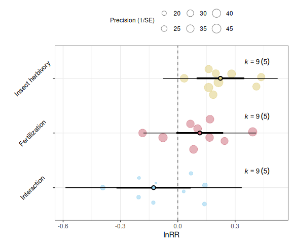

<!-- README.md is generated from README.Rmd. Please edit that file -->

# minter 

<!-- badges: start -->

[](https://github.com/fdecunta/minter/actions/workflows/R-CMD-check.yaml)
[](https://app.codecov.io/gh/fdecunta/minter)
<!-- badges: end -->

Helper functions for conducting meta-analyses of interactions in 2×2
factorial experiments.

## Installation

You can install the development version of minter from
[GitHub](https://github.com/fdecunta/minter):

``` r
devtools::install_github("fdecunta/minter", force = TRUE)
```

## Example

You can compute a bunch of effect sizes with one function:

``` r
library(minter)

# Load fake data from a 2-by-2 factorial experiment:
# - Insect herbivory (Herb)
# - Fertilization (Fert)
data(fake_data)

# Compute the effect sizes
fake_data <- factorial_effsize(
  effsize = "lnrr",
  colnames = c("Herb", "Fert"),
  data = fake_data,
  Ctrl_mean = C_mean,
  Ctrl_sd = C_sd,
  Ctrl_n = C_n,
  A_mean = Herb_mean,
  A_sd = Herb_sd,
  A_n = Herb_n,
  B_mean = Fert_mean,
  B_sd = Fert_sd,
  B_n = Fert_n,
  AB_mean = HxF_mean,
  AB_sd = HxF_sd,
  AB_n = HxF_n
)

str(fake_data)
#> 'data.frame':    9 obs. of  24 variables:
#>  $ Study                : chr  "Study_1" "Study_1" "Study_2" "Study_3" ...
#>  $ C_mean               : num  8.46 8.75 8.2 11.33 10.6 ...
#>  $ C_sd                 : num  1.48 1.27 1.56 1.91 1.9 ...
#>  $ C_n                  : int  23 26 23 20 27 23 28 27 25
#>  $ Herb_mean            : num  10.9 10.1 10.7 12.9 13.1 ...
#>  $ Herb_sd              : num  1.4 1.48 1.56 1.7 1.92 ...
#>  $ Herb_n               : int  27 29 23 24 26 20 27 27 29
#>  $ Fert_mean            : num  9.7 11.47 11.16 9.08 10.86 ...
#>  $ Fert_sd              : num  1.02 1.5 1.87 1.01 1.07 ...
#>  $ Fert_n               : int  30 30 28 23 29 26 28 26 29
#>  $ HxF_mean             : num  11 10.8 12.9 11.1 15.4 ...
#>  $ HxF_sd               : num  1.63 1.48 1.16 1.01 1.45 ...
#>  $ HxF_n                : int  28 23 25 21 20 24 28 23 22
#>  $ EffectSize_ID        : int  1 2 3 4 5 6 7 8 9
#>  $ Herb_simple_lnRR     : num  0.251 0.145 0.263 0.13 0.208 ...
#>  $ Herb_simple_lnRR_var : num  0.00194 0.00154 0.00251 0.00215 0.00202 ...
#>  $ Fert_simple_lnRR     : num  0.136 0.271 0.308 -0.2216 0.0239 ...
#>  $ Fert_simple_lnRR_var : num  0.0017 0.00138 0.00259 0.00196 0.00153 ...
#>  $ Herb_overall_lnRR    : num  0.1852 0.0334 0.1987 0.1615 0.2813 ...
#>  $ Herb_overall_lnRR_var: num  0.000744 0.000725 0.000904 0.000839 0.000682 ...
#>  $ Fert_overall_lnRR    : num  0.066 0.166 0.245 -0.184 0.103 ...
#>  $ Fert_overall_lnRR_var: num  0.000751 0.000729 0.000904 0.000744 0.000703 ...
#>  $ Herb_x_Fert_lnRR     : num  -0.128 -0.2051 -0.1153 0.0688 0.1398 ...
#>  $ Herb_x_Fert_lnRR_var : num  0.0031 0.00293 0.00384 0.00308 0.0028 ...
```

When non-independence of sampling variances exists, you may use an
estimated variance-covariance matrix.

For multiple effect sizes you need multiple matrices. You can do it with
one call:

``` r
vi_cols <- c(
  "Herb_simple_lnRR_var",
  "Fert_simple_lnRR_var",
  "Herb_overall_lnRR_var",
  "Fert_overall_lnRR_var",
  "Herb_x_Fert_lnRR_var"
)

VCVs <- factorial_vcv(
  vi_cols = vi_cols,
  cluster = Study,
  obs = EffectSize_ID,
  rho = 0.5,
  data = fake_data
)

str(VCVs)
#> List of 5
#>  $ Herb_simple_lnRR_var : num [1:9, 1:9] 0.001941 0.000865 0 0 0 ...
#>  $ Fert_simple_lnRR_var : num [1:9, 1:9] 0.001701 0.000765 0 0 0 ...
#>  $ Herb_overall_lnRR_var: num [1:9, 1:9] 0.000744 0.000367 0 0 0 ...
#>  $ Fert_overall_lnRR_var: num [1:9, 1:9] 0.000751 0.00037 0 0 0 ...
#>  $ Herb_x_Fert_lnRR_var : num [1:9, 1:9] 0.0031 0.00151 0 0 0 ...
```

Use a specific VCV matrix by referencing it using ‘\$’:

``` r
# Overall effect of Insect Herbivores
res_herb <- metafor::rma.mv(
  yi = Herb_overall_lnRR,
  V  = VCVs$Herb_overall_lnRR_var,
  random = ~ 1 | Study,
  test = "t",
  data = fake_data)

# Overall effect of Fertilization
res_fert <- metafor::rma.mv(
  yi = Fert_overall_lnRR,
  V  = VCVs$Fert_overall_lnRR_var,
  random = ~ 1 | Study,
  test = "t",
  data = fake_data)

# Interaction effect 
res_intr <- metafor::rma.mv(
  yi = Herb_x_Fert_lnRR,
  V  = VCVs$Herb_x_Fert_lnRR_var,
  random = ~ 1 | Study,
  test = "t",
  data = fake_data)
```

Aggregate the results from the three models into a single table.

``` r
# factorial_mod_results() uses orchaRd::mod_results() internally
# library(orchaRd) 

models <- list(
  "Insect herbivory" = res_herb,
  "Fertilization" = res_fert,
  "Interaction" = res_intr
)

res_table <- factorial_mod_results(
  models = models,
  group = "Study"
)

res_table
#>               name   estimate      lowerCL    upperCL     lowerPR   upperPR
#> 1      Interaction -0.1265575 -0.320658852 0.06754378 -0.58768793 0.3345729
#> 2    Fertilization  0.1149527 -0.007502029 0.23740741 -0.17970732 0.4096127
#> 3 Insect herbivory  0.2229779  0.098505410 0.34745043 -0.07655605 0.5225119
```

You may want to visualize this results, and `orchaRd` package has great
visualization tools for meta-analyses. So `minter` is designed to work
with it.

The output from `factorial_mod_results` follows the format used by
`orchaRd`, and can be directly used in `orchaRd:orchard_plot()`:

``` r
orchaRd::orchard_plot(
  res_table,
  group = "Study",
  xlab = "lnRR",
  legend.pos = "top.out",
  angle = 45
)
```


